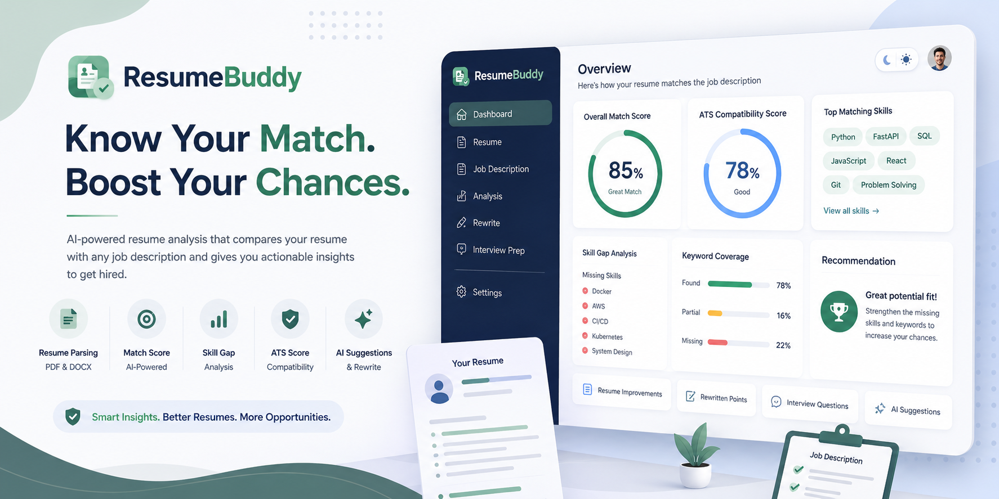
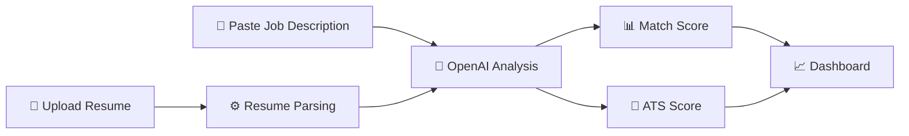

<!-- ==================== BANNER ==================== -->

<p align="center">
  
</p>

<h1 align="center">ResumeBuddy</h1>

<p align="center">


</p>

<p align="center">


</p>

---

# 📖 About

ResumeBuddy is an **AI-powered Resume Job Match Scorer** that analyzes resumes against job descriptions using **OpenAI**, providing ATS scores, skill-gap analysis, missing keywords, resume improvements, and interview preparation suggestions.

---

# ✨ Features

<table>

<tr>

<td width="50%">

✅ Resume Parsing (PDF & DOCX)

✅ ATS Compatibility Score

✅ Skill Gap Analysis

✅ Missing Keywords Detection

✅ Resume Rewrite Suggestions

</td>

<td width="50%">

✅ AI Bullet Point Rewriter

✅ Interview Question Generator

✅ Interactive Dashboard

✅ Charts & Analytics

✅ Dark / Light Theme

</td>

</tr>

</table>

---

# ⚡ Workflow



---

# 🛠 Tech Stack

| Frontend | Backend | AI | Parsing |
|-----------|----------|------|---------|
| React | FastAPI | OpenAI | pdfplumber |
| Vite | Python | GPT-4o | python-docx |
| TailwindCSS | Pydantic | Prompt Engineering | |

---

# 📂 Project Structure

```text
ResumeBuddy/

├── backend/

├── frontend/

├── README.md

├── banner.png

└── LICENSE
```

---

# 📊 Dashboard Preview

<p align="center">


</p>

---

# 🚀 Installation

```bash
git clone https://github.com/yourusername/ResumeBuddy.git

cd ResumeBuddy
```

Backend

```bash
cd backend

pip install -r requirements.txt

uvicorn app:app --reload
```

Frontend

```bash
cd frontend

npm install

npm run dev
```

---

# 🎯 Roadmap

- [x] Resume Upload

- [x] ATS Score

- [x] Skill Gap Analysis

- [x] AI Resume Rewrite

- [x] Interview Questions

- [ ] Resume History

- [ ] Authentication

- [ ] Export to PDF

- [ ] Company-specific Analysis

---


# 💙 Made With

<p align="center">


</p>

---

<p align="center">


</p>

<h3 align="center">

⭐ If you like this project, don't forget to star the repository!

</h3>
