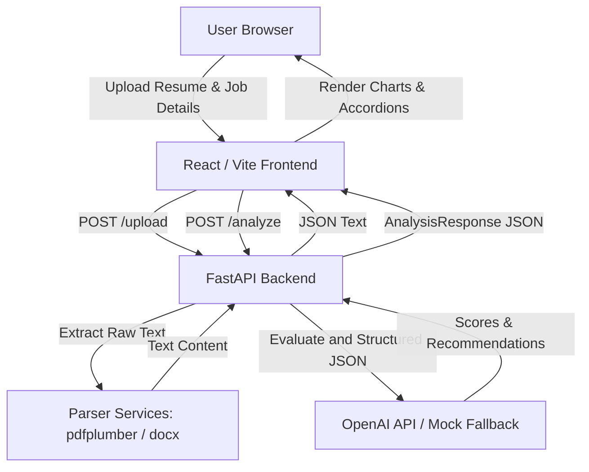

# ResumeBuddy

A production-ready full-stack AI-powered dashboard application that analyzes resumes (PDF and DOCX formats) against target job descriptions. The application scores compatibility, measures ATS readability, details skill gaps, generates editable AI bullet point rewrites, and prepares potential interview questions.

---

## Architecture Overview



---

## Tech Stack

### Backend
* **Python** (FastAPI framework)
* **OpenAI API** (GPT-4o-mini structured analysis)
* **pdfplumber** (PDF document text extraction)
* **python-docx** (DOCX document text extraction)
* **Pydantic** (Data modeling & validation schemas)
* **Uvicorn** (Asynchronous ASGI server)

### Frontend
* **React** (Vite + TypeScript)
* **Tailwind CSS v3** (Glassmorphic dark/light styles)
* **Framer Motion** (Fluid page and loader animations)
* **Lucide Icons** (UI vector indicators)
* **Axios** (API requests)

---

## Project Structure

```text
Resume Scorer/
├── backend/
│   ├── models/
│   │   └── schemas.py          # Pydantic request/response structures
│   ├── routes/
│   │   ├── analyze.py          # Resume assessment endpoint (/analyze)
│   │   ├── health.py           # Core status checker (/health)
│   │   └── upload.py           # File processing endpoint (/upload)
│   ├── services/
│   │   ├── openai_service.py   # OpenAI communication & Mock Fallback
│   │   └── parser.py           # pdfplumber / docx parser
│   ├── .env.example            # Configuration templates
│   ├── .env                    # Active local environment keys
│   ├── requirements.txt        # Backend python packages
│   └── app.py                  # API entry point & CORS configuration
│
├── frontend/
│   ├── src/
│   │   ├── components/
│   │   │   ├── Charts.tsx      # SVG interactive statistics charts
│   │   │   ├── Dashboard.tsx   # Detailed analysis metrics panel
│   │   │   ├── LandingPage.tsx # Hero, dropzone, and input text-areas
│   │   │   └── ThemeToggle.tsx # Light/dark mode dynamic control
│   │   ├── App.tsx             # State router & toast notifier
│   │   ├── index.css           # Styling configuration and custom scrollbars
│   │   └── main.tsx            # DOM node mounting entrypoint
│   ├── index.html              # HTML core shell & Google Fonts imports
│   ├── package.json            # Node JS packages configuration
│   ├── postcss.config.js       # CSS post-processors configuration
│   ├── tailwind.config.js      # Styling themes mapping
│   ├── tsconfig.json           # Compiler rules for TypeScript
│   └── vite.config.ts          # Vite bundler parameters
└── README.md                   # System Documentation
```

---

## Installation & Setup

### Prerequisites
* Python 3.9 or higher
* Node.js 18.0 or higher
* npm (Node Package Manager)

### 1. Setup the Backend API

1. Navigate to the `backend/` directory:
   ```bash
   cd backend
   ```

2. Create a virtual environment (optional but recommended):
   ```bash
   python -m venv venv
   # On Windows:
   .\venv\Scripts\activate
   # On macOS/Linux:
   source venv/bin/activate
   ```

3. Install required Python packages:
   ```bash
   pip install -r requirements.txt
   ```

4. Create and edit your environment variables file:
   Copy `.env.example` to `.env` and fill in your OpenAI API Key:
   ```env
   OPENAI_API_KEY=your_actual_openai_key_here
   PORT=8000
   ```
   > [!NOTE]
   > **Mock Mode Fallback**: If you do not configure an `OPENAI_API_KEY`, the application will automatically enter **Mock Analysis Mode**. It will scan the job description/resume for standard keywords and return realistic mockup metrics. This permits complete testing of the frontend, file upload parser, charts, and editing dashboard immediately without requiring active tokens.

5. Start the FastAPI development server:
   ```bash
   uvicorn app:app --reload
   ```
   The backend API will run on **`http://localhost:8000`**. You can view the automated OpenAPI documentation by visiting `http://localhost:8000/docs`.

---

### 2. Setup the Frontend Client

1. Navigate to the `frontend/` directory:
   ```bash
   cd ../frontend
   ```

2. Install Node.js dependencies:
   ```bash
   npm install
   ```

3. Start the Vite React development server:
   ```bash
   npm run dev
   ```
   The frontend will run on **`http://localhost:5173`**. Open this address in your web browser.

---

## Verification & Usage Flow

1. **Accessing the landing page**: Load the client inside your browser. The application logo should appear alongside an **API Connected** status pill at the header.
2. **Uploading documents**: Drop a `.pdf` or `.docx` file into the upload zone. The app verifies document formats and reads character lengths.
3. **Pasting target requirements**: Paste standard job specifications in the input area and note the live word counters.
4. **Analyzing records**: Click **Analyze Compatibility**. Upon completion, you will be redirected to the scoring suite dashboard.
5. **Checking statistics**: Verify overall scores, donut skill charts, and bar coverages. Select tabs to edit AI-rewritten resume bullet points or study interview preparation questions.
6. **Theme Toggling**: Click the header Sun/Moon button to inspect high-contrast light and dark themes.
